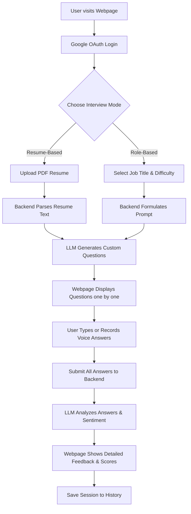
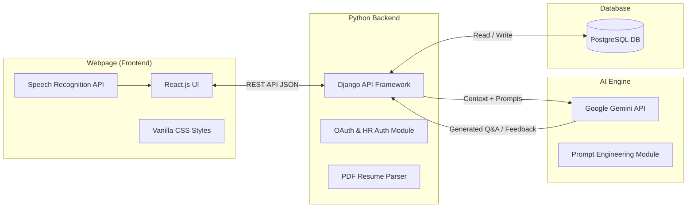

# Cognivue AI - Project Details & Workflow

## 1. Project Overview
Cognivue AI is a specialized LLM (Large Language Model) project designed to simulate real-world interviews and provide intelligent feedback. To make the system accessible, interactive, and easy to use, I have built a webpage interface around it. However, at its core, it is an LLM-driven application focused on dynamic question generation and response analysis, rather than just a standard full-stack web application.

## 2. Overall Workflow

The workflow of the project dictates how a user interacts with the system from start to finish.



### Workflow Description:
1. **Authentication:** The user logs in securely using Google OAuth.
2. **Setup:** The candidate chooses between uploading a resume or manually selecting a job role and difficulty.
3. **Generation:** The backend sends the context (resume text or job role) to the LLM. The LLM tailors specific HR, Technical, and Project-based questions.
4. **Interview:** The webpage displays the questions. The user answers them using text or voice-to-text recording.
5. **Evaluation:** Once completed, the answers are sent back to the LLM. The LLM acts as an evaluator and sentiment analyzer, scoring the responses.
6. **Review:** The user receives a detailed breakdown of their performance on the feedback page, and the data is saved in their profile history.

## 3. Architecture Diagram



## 4. Components & How They Work

### A. The Webpage Interface (Frontend Component)
- **What it is:** The user-facing part of the project built with React and Vanilla CSS.
- **How it works:** It communicates with the Python backend via REST APIs to fetch questions and send user answers. It also manages state, like navigating between the dashboard, the active interview session, and the feedback screen.
- **Usage:** Provides a clean, dark/light mode UI where users can comfortably read questions, use voice recording to answer, and view their analytics charts.

### B. The API Server (Backend Component)
- **What it is:** A Django-based Python server that acts as the bridge between the webpage, the database, and the LLM.
- **How it works:** It processes HTTP requests, manages user sessions, validates data, and extracts text from uploaded PDF resumes.
- **Usage:** Ensures secure data flow and handles the heavy lifting of preparing the data before sending it to the AI.

### C. The Intelligence Engine (LLM Component)
- **What it is:** The Google Gemini API integrated into the Python backend.
- **How it works:** It accepts crafted text prompts containing the user's role or resume text. It then uses its vast training data to output highly relevant interview questions and, later, evaluates the answers.
- **Usage:** Acts as both the mock interviewer generating questions, and the judge calculating scores and providing feedback.

### D. The Storage System (Database Component)
- **What it is:** A PostgreSQL database.
- **How it works:** Stores user profiles, unique candidate IDs (e.g., `22BAD12345`), generated questions, user answers, and the final LLM feedback securely.
- **Usage:** Allows users to view their past interviews and allows HR professionals to search for candidates based on performance.

## 5. What Each Webpage Does

- **Login / HR Login Page:** Serves as the entry point. Standard users log in via Google. HR professionals have a separate portal with Email OTP (One-Time Password) verification for security.
- **Dashboard (Mode Selection):** The main hub where users decide how they want to be interviewed (Resume-upload or Role-selection).
- **Resume Upload Page:** A dedicated screen that accepts PDF files, allowing the system to extract projects and skills.
- **Interview Session Page:** The core interactive page. It displays one question at a time. It features a text area for typing and integrates the browser's Speech Recognition tool so users can speak their answers directly.
- **Feedback & Analysis Page:** The results screen. It visually breaks down the candidate's performance using progress bars, categorizing scores into HR, Technical, Cultural, and format accuracy.
- **Session History:** A log page where users can review all their past interviews, track their score improvements, and read past feedback.
- **User Profile:** Displays the user's unique UID, total interviews taken, and average score statistics.
- **HR Dashboard:** A special search portal for recruiters to find candidates using their UID or filtering by job role to view top performers.

## 6. Methods Used in the Project

- **Prompt Engineering:** Designing highly specific, structured text instructions to force the LLM to behave strictly as an interviewer and return data in a predictable format (JSON) instead of conversational text.
- **Contextual Generation (RAG pattern logic):** Passing user-specific data (like resume text) as context to the LLM so it generates personalized output rather than generic questions.
- **RESTful API Architecture:** Designing standardized endpoints (URLs) for smooth communication between the webpage and the backend.
- **Token-based Authentication:** Using OAuth and secure sessions to manage user identity without storing passwords for candidates.
- **Natural Language Processing (NLP) / Sentiment Analysis:** Utilizing the LLM to understand and grade the tone and quality of human responses.

## 7. How the LLM is Handled and Customized

In this project, the LLM is not just a chatbot; its behavior is heavily customized and constrained to serve a singular, professional purpose.

- **Role Constraints (System Prompts):** I customized the LLM by defining its persona. Before asking it to generate questions, the backend sends a hidden prompt telling it to "Act as a strict Senior Technical Recruiter" and outlines the exact rules it must follow. 
- **Format Customization:** A major challenge with LLMs is that they output plain text, which is hard for a webpage to read. I handled this by instructing the LLM to format its output strictly as structured JSON data. This allows the backend to easily separate HR questions from Technical questions.
- **Dynamic Context Parsing:** The LLM is fed customized context depending on the user's choice. If the user uploads a resume, the LLM receives the extracted text and is instructed to target specific projects mentioned in that resume rather than asking generic questions.

## 8. Using the LLM as a Sentiment & Tone Analyzer

One of the most powerful ways I used the LLM in this project is as a **Sentiment and Tone Analyzer** during the feedback stage. 

When a user submits their answers, the backend sends the original question along with the user's response to the LLM. 
1. **Behavioral Analysis:** I instructed the LLM to analyze the *sentiment* and *confidence* behind the text. It looks for hesitation, clarity, and professionalism in the words used.
2. **Strengths and Weaknesses:** By analyzing the semantics, the LLM detects behavioral traits. If the answer is unsure or vague, the sentiment analyzer flags it as an "Area heavily needing improvement." If the answer is structured and authoritative, it praises the candidate's communication skills.
3. **Scoring Model:** It converts this qualitative sentiment analysis into quantitative metrics (e.g., assigning a 75/100 for Technical accuracy and an 80/100 for HR/Cultural fit). 

## 9. File Structure Overview

```
Cognivue-AI/
├── backend/                  # Python/Django Server Layer
│   ├── accounts/             # Manages Users, Context, and UID generation
│   ├── interviews/           # Handles interview sessions and saving answers
│   ├── hr/                   # Manages HR portal, OTP, and Email verification
│   ├── cognivue/             # Core settings and URL routing
│   └── core/                 # Where the LLM connection, prompt generation, and PDF parsing happens
│
├── frontend/                 # React Webpage Layer
│   └── src/
│       ├── components/       # UI elements (Dashboard, Interview View, History, Feedback)
│       ├── App.jsx           # Main webpage routing
│       ├── api.js            # Connection logic to talk to the backend
│       └── index.css         # Styling for the webpage
│
└── .env                      # Secure environment variables (API keys, DB URLs)
```

---

## 10. Theoretical Foundation

Theoretically, this project applies **Generative Artificial Intelligence** to the domain of **Human Resource Management and Cognitive Assessment**. By utilizing a Large Language Model architecture (specifically Transformer-based neural networks like Gemini), the project moves away from static, rule-based question banks (which are predictable and easily memorized) toward a system of **dynamic, unbounded cognitive testing**. 

What I have done is create a pipeline that translates unstructured data (a PDF resume) into a structured conceptual model. The LLM then uses this model to synthesize unique nodes of inquiry (the interview questions). Furthermore, during the evaluation phase, the system performs **computational linguistics and semantic analysis** on the candidate's responses. By acting as a sentiment and tone analyzer, the AI evaluates not just factual correctness (objective evaluation), but also the qualitative properties of the communication—such as confidence, structure, and professional tone (subjective evaluation). 

In essence, this project theoretically proves that LLMs can be successfully constrained and orchestrated via prompt engineering and webpage interfaces to securely automate the highly subjective, deeply human process of candidate evaluation and skill assessment.
